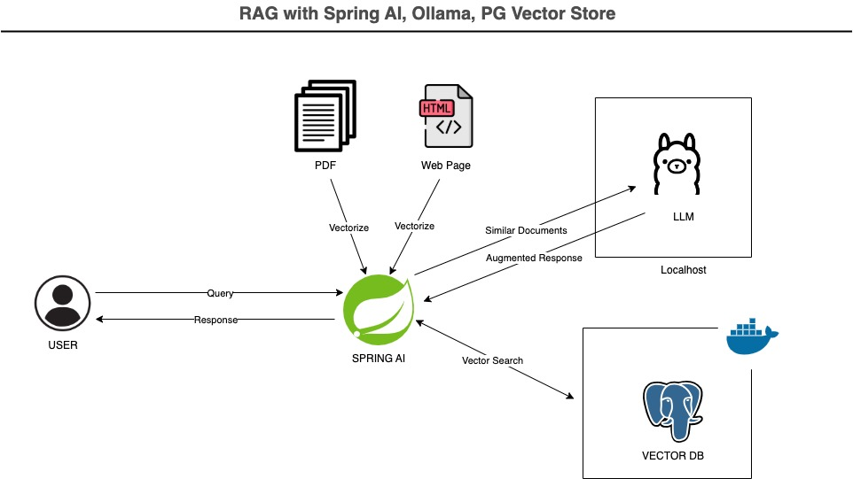

# SpringBoot AI-based RAG with Ollama Llama 3.2 Model and PGVector

This project is a Spring Boot application that implements a **Retrieval-Augmented Generation (RAG)** system. It leverages the **Ollama Llama 3.2 model** as the Large Language Model (LLM) and uses **PGVector** for vector storage to provide an intelligent question-answering system based on PDFs. The application is designed to train on any PDF, converting the content into a vector store, and answering user queries related to the document.

## Features

- **AI-Powered Question Answering**: The application uses the Ollama Llama 3.2 model (can use any other models as well) to generate responses based on the contents of the provided PDF.
- **PDF/HTML Training**: The application can be trained on any PDF or HTML file. It extracts the content and stores it in a vector format for efficient retrieval.
- **PGVector Integration**: Uses **PGVector**, a PostgreSQL extension for vector-based search, to store and retrieve document embeddings.
- **Spring Boot Backend**: The entire application is built using Spring Boot, ensuring seamless integration with the backend and easy API access.

## Technologies Used

- **Spring Boot**: Backend framework to build the API.
- **Spring Boot AI**: AI framework to work with LLMs.
- **Ollama Llama 3.2**: Language model used for question answering based on document content.
- **PGVector**: PostgreSQL extension for vector storage and similarity search.
- **PostgreSQL**: Database used to store vectors and metadata.
- **PDF Parsing**: Extract text content from PDF files to convert them into vectors.
- **Spring Boot Compose**: For running dockarized container.
- **Spring Reacitve**: Asynchronous, Non-blocking API calls.

## Prerequisites

Before you begin, ensure you have the following:

- **JDK 21+** installed on your system (for running the Spring Boot application).
- **Docker** for running with the **PGVector** container.
- **Ollama Llama 3.2 Model** installed and accessible for use within the application.
- **Maven** for building the project.

